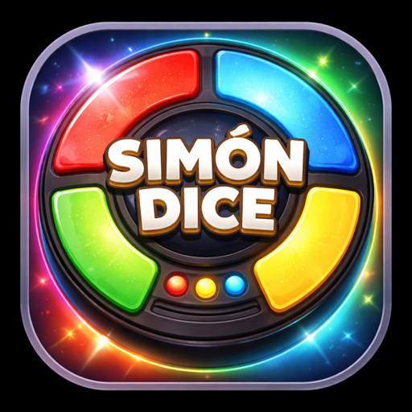

# Simón Dice

<p align="center">
  
</p>

Juego de memoria clásico construido con HTML, CSS y JavaScript vanilla. Sin dependencias ni frameworks.

## Demo

[Ver demo en GitHub Pages](https://jmfernandez82.github.io/simon-dice)

## Características

- **3 niveles de dificultad** — Fácil, Normal y Difícil, con velocidad de secuencia progresiva
- **3 modos de juego** — Clásico (sin límite), Contrarreloj (tiempo por turno) y 2 Jugadores (por turnos)
- **Récord persistente** por combinación de dificultad y modo, guardado en `localStorage`
- **Historial** de las últimas 5 partidas con fecha y hora
- **Diseño mobile-first** con tablero circular inspirado en el Simon original
- **Tema claro / oscuro** con toggle y persistencia entre sesiones
- **Accesibilidad** — WCAG AA, `aria-live`, `aria-label`, navegación por teclado y `focus-visible`
- **Audio** generado con Web Audio API (notas musicales Do, Re, Mi, Sol)

## Estructura

```
simon-dice/
├── src/          ← código fuente de desarrollo
│   ├── index.html
│   ├── style.css
│   └── script.js
└── docs/         ← versión publicada (GitHub Pages)
    ├── index.html
    ├── style.css
    └── script.js
```

## Tecnologías

- HTML5 semántico
- CSS3 — custom properties, glassmorphism, `clamp()`, `grid`, animaciones
- JavaScript ES6+ — Web Audio API, `localStorage`, máquina de estados
